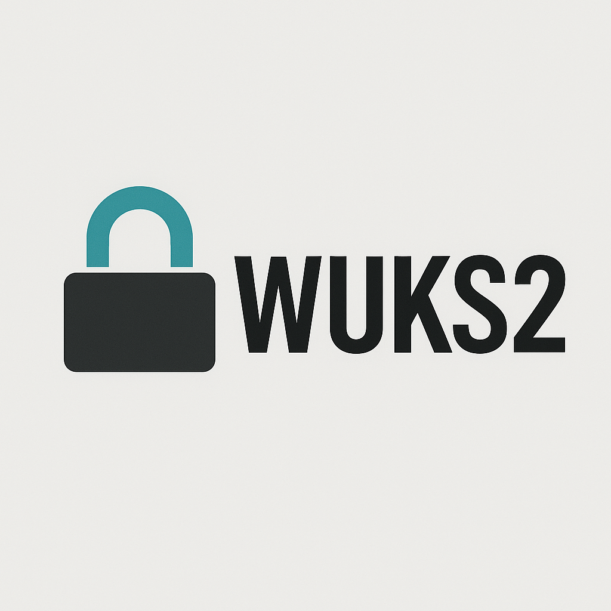

# 🔐 WUKS2 - Windows Unified Key Setup v2

> A modern, LUKS2-inspired full-disk encryption system for Windows.

---

## 💡 Overview

**WUKS2** is a secure, open-source, LUKS2-style full-disk encryption system for Windows. Designed for power users, red teamers, and those who demand data security at the OS level.

- 🔒 AES-XTS + Argon2i based encryption
- 🔑 Multiple key slots
- 🖥️ Bootloader integration
- ✅ TPM optional support
- 🧪 Open-source and audit-friendly

---

## 📁 Folder Structure

- `src/core` – Encryption engine and key manager
- `src/bootloader` – Bootloader hook/patching
- `src/ui/cli` – Command-line interface
- `src/ui/gui` – Graphical interface (WinAPI/Qt/wxWidgets)
- `docs` – Architecture, flow diagrams, etc.
- `tests` – Unit tests for crypto components

---

## 🚀 Getting Started

* git clone https://github.com/yourusername/WUKS2.git
* cd WUKS2
* .\scripts\build.ps1

---

## 🔐 Features 

* Full-disk sector-based encryption
* Linux-style cryptsetup compatibility (planned)
* TPM & keyfile support
* Emergency wipe keys
* Argon2 or PBKDF2 password hashing
* Encrypted volume header

## 🛠️ Roadmap

✅ Core encryption engine

*[*] Bootloader integration (In Development )
*[*] GUI interface (In Development )
*[*] Recovery volume support (In Development )
*[*] External volume support {USB, HDD} (In Development ) 
*[*] Linux compatibility {LUKS2 decode} (In Development )

